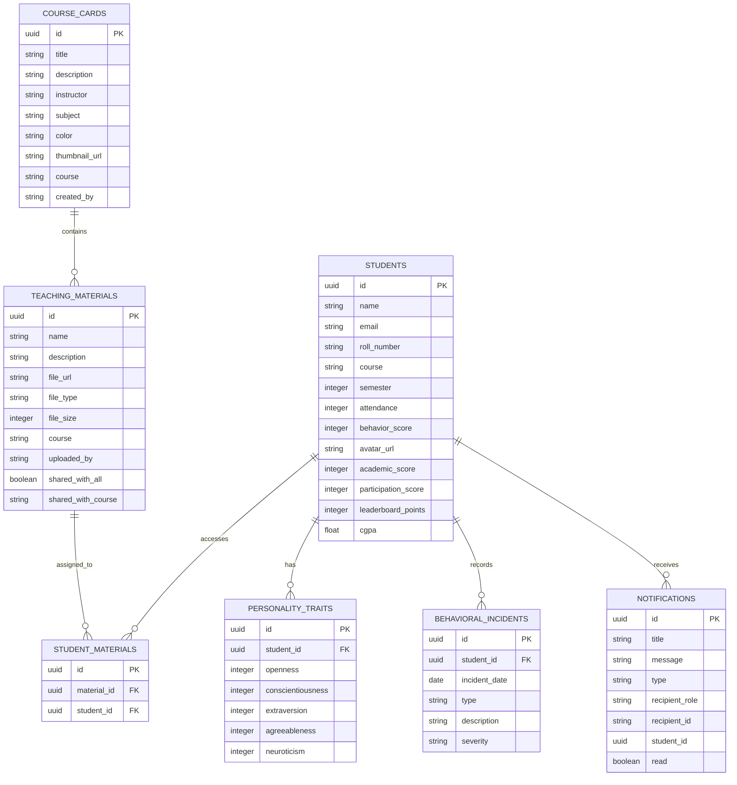
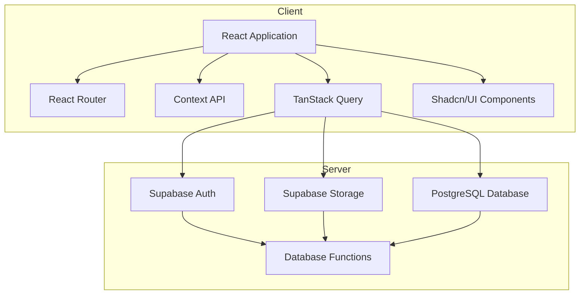
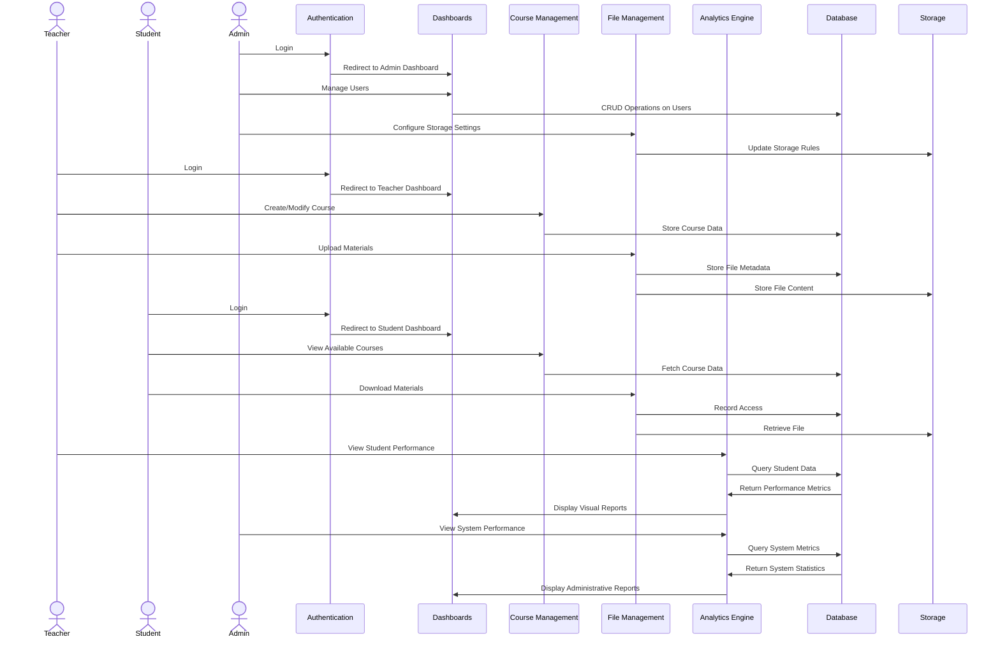

# 🎓 Student Personality and Behavioral Management System

A comprehensive web application for tracking student behavior patterns, academic performance, and generating insightful educational analytics — revolutionizing how educators and students interact in digital learning environments.

---

## ✨ Overview

The Student Personality and Behavioral Management System is an Automated System for Recording Student Behaviour and Academic Performance streamlines assessment workflows for educators and enhances transparency for students. Built with modern web technologies, it provides a seamless interface for behavior tracking, academic performance analysis, file sharing, and comprehensive reporting.:

- Behavior and performance tracking
- Course and file management
- Data visualization and reporting
- Role-based dashboards
- Real-time notifications and gamified progress tracking

---

## 🚀 Key Features

- **Secure Authentication** – Role-based access for teachers, students, and admins
- **Dashboards** – Personalized dashboards with actionable insights
- **Course Management** – Create, edit, and organize course structures
- **File Management** – Upload and share educational materials with access control
- **Student Progress Analytics** – Monitor attendance, participation, and academic progress
- **Behavioral Insights** – Record and analyze behavior incidents
- **Interactive Reporting** – Generate customizable and exportable reports
- **Integrated Calendar** – Schedule and manage classes and events
- **Gamified Leaderboard** – Encourage achievement and friendly competition
- **Real-time Notifications** – Keep all users updated instantly

---

## 💻 Tech Stack

### Frontend

- React 18 + TypeScript
- Tailwind CSS with responsive design
- Shadcn/UI for consistent UI elements
- React Context API and TanStack Query for state management
- React Router v6 for routing
- Recharts for data visualizations

### Backend

- Supabase PostgreSQL database
- Supabase Auth for secure authentication
- Supabase Storage for file uploads and management
- RESTful APIs endpoints

### Tooling & Deployment

- Vite for builds
- TypeScript strict mode
- Deployment via Vercel


## 🏗️ Project Structure

The application follows a modern component-based architecture with clear separation of concerns:

```
.
├── public/                             # Static assets
├── src/                                # Frontend source code
│   ├── components/                     # Reusable UI components
│   │   ├── student/                    # Student-specific components
│   │   ├── reports/                    # Reporting and analytics components
│   │   ├── notifications/              # Notification system components
│   │   └── ui/                         # Base UI components from shadcn/ui
│   ├── context/                        # React context providers for global state
│   ├── hooks/                          # Custom React hooks for shared logic
│   ├── integrations/                   # Third-party service integrations
│   │   └── supabase/                   # Supabase client and type definitions
│   ├── lib/                            # Utility libraries
│   ├── pages/                          # Page components for main routes
│   ├── types/                          # TypeScript type definitions
│   ├── utils/                          # Utility functions and helpers
│   ├── App.css                         # Global styles
│   ├── App.tsx                         # Main App component
│   ├── index.css                       # Additional global styles
│   ├── main.tsx                        # Application entry point
│   ├── routes.tsx                      # Application routing configuration
│   └── vite-env.d.ts                   # Vite environment type declarations
├── supabase/                           # Supabase backend functions and config
│   ├── functions/
│   │   ├── admin-create-users/         # Custom Supabase function to create users
│   │   │   └── index.ts                # Entry point for admin user creation
│   │   └── auth/                       # Supabase auth-related functions
│   │       └── index.ts                # Entry point for auth handling
│   └── config.toml                     # Supabase configuration
├── full_dump.sql                       # SQL dump of the database
├── index.html                          # Base HTML template
├── bun.lockb                           # Lockfile for Bun package manager
├── components.json                     # Component configuration (possibly for ShadCN)
├── eslint.config.js                    # ESLint configuration
├── package.json                        # Project metadata and dependencies
├── package-lock.json                   # Dependency lockfile
├── postcss.config.js                   # PostCSS configuration
├── README.md                           # Documentation overview of the project
├── tailwind.config.ts                  # Tailwind CSS configuration
├── tsconfig.app.json                   # TypeScript config for app
├── tsconfig.json                       # Root TypeScript configuration
├── tsconfig.node.json                  # TypeScript config for Node functions
├── vercel.json                         # Vercel deployment configuration
├── vite.config.ts                      # Vite bundler configuration
└── yarn.lock                           # Lockfile for Yarn
```

## 📊 Database Schema

The application utilizes a normalized PostgreSQL database schema through Supabase:

### Core Tables

- **students** - Comprehensive student profiles with academic metrics
  - Primary academic indicators: attendance, behavior_score, academic_score
  - Performance tracking: participation_score, leaderboard_points, cgpa

- **personality_traits** - Psychological profile data for each student
  - Five-factor model: openness, conscientiousness, extraversion, agreeableness, neuroticism

- **behavioral_incidents** - Documented behavioral events
  - Categorized by type, severity, and detailed descriptions

- **teaching_materials** - Educational resources with access controls
  - Metadata: name, description, file details
  - Access management: shared_with_all, shared_with_course

- **notifications** - System-wide messaging infrastructure
  - Targeted by recipient roles and IDs
  - Categorized by type and read status

- **course_cards** - Course information and metadata
  - Visual customization: color, thumbnail_url
  - Content organization: title, description, subject

### Relationships

- Students have personality traits (one-to-one)
- Students are associated with behavioral incidents (one-to-many)
- Courses contain teaching materials (one-to-many)
- Students have access to specific materials (many-to-many through student_materials)
- Users receive targeted notifications (one-to-many)




## Application Architecture



## System Architecture

```mermaid
graph TD
    %% User Nodes with Role Distinction
    subgraph Users
        Teacher["Teacher"]
        Student["Student"]
        Admin["Admin"]
    end
    
    %% Frontend
    subgraph "Client (Frontend)"
        RA["React Application"]
        R["Routing (React Router)"]
        SM["State Management<br>(Context + TanStack Query)"]
        UI["UI Components<br>(Tailwind CSS + shadcn/UI)"]
        DV["Data Visualization<br>(Recharts/Reports)"]
    end
    
    %% Backend Integration
    SC["Supabase Client"]
    
    %% Backend
    subgraph "Server (Backend)"
        SA["Supabase Auth"]
        SS["Supabase Storage"]
        DB["PostgreSQL Database"]
        SF["Supabase Functions"]
        SCfg["Supabase Config/Settings"]
        FS["File Storage (Uploads)"]
    end
    
    %% Admin-specific Features
    subgraph "Admin Features"
        UM["User Management"]
        SD["System Dashboard"]
        SysCfg["System Configuration"]
    end
    
    %% Teacher-specific Features
    subgraph "Teacher Features"
        BT["Behavior Tracking"]
        APM["Academic Performance Monitoring"]
        CM["Course Management"]
        FM["File Management"]
    end
    
    %% Student-specific Features
    subgraph "Student Features"
        LP["Learning Progress"]
        LD["Leaderboard"]
        SN["Student Notifications"]
        AM["Access Materials"]
    end
    
    %% User Connections to Application
    Teacher --> RA
    Student --> RA
    Admin --> RA
    
    %% Frontend Internal Connections
    RA --> R
    RA --> SM
    RA --> UI
    UI --> DV
    
    %% Frontend to Backend Integration
    SM --> SC
    UI --> SC
    
    %% Backend Integration to Backend Services
    SC --> SA
    SC --> SS
    SC --> DB
    SC --> SF
    
    %% Backend Relationships
    SF --> DB
    SF --> SA
    SS --> FS
    SF --> SCfg
    
    %% Role-specific Features Connections
    Admin --- UM
    Admin --- SD
    Admin --- SysCfg
    UM --> SA
    SD --> DB
    SysCfg --> SCfg
    
    Teacher --- BT
    Teacher --- APM
    Teacher --- CM
    Teacher --- FM
    BT --> DB
    APM --> DB
    CM --> DB
    FM --> SS
    
    Student --- LP
    Student --- LD
    Student --- SN
    Student --- AM
    LP --> DB
    LD --> DB
    SN --> DB
    AM --> SS
    
    %% Style Classes
    classDef frontend fill:#c6e2ff,stroke:#333,stroke-width:1px;
    classDef backend fill:#ffcccb,stroke:#333,stroke-width:1px;
    classDef user fill:#d1e7dd,stroke:#333,stroke-width:1px;
    classDef admin fill:#ffe8a1,stroke:#333,stroke-width:1px;
    classDef teacher fill:#d8f8e1,stroke:#333,stroke-width:1px;
    classDef student fill:#e6d9ff,stroke:#333,stroke-width:1px;
    
    %% Apply Classes
    class RA,R,SM,UI,DV frontend;
    class SA,SS,DB,SF,SCfg,FS backend;
    class Teacher,Student,Admin user;
    class UM,SD,SysCfg admin;
    class BT,APM,CM,FM teacher;
    class LP,LD,SN,AM student;
    class SC backend;
```




## 🚦 Data Flow



1. **Authentication Flow**
   - User login credentials validated against Supabase Auth
   - JWT tokens stored in secure localStorage
   - Role-based redirects to appropriate dashboards

2. **Content Delivery**
   - Teachers upload materials to Supabase Storage
   - Access controls applied based on course and student selections
   - Materials securely served to authorized students

3. **Analytics Processing**
   - Student interaction data collected and stored
   - Real-time metrics calculated and visualized
   - Trend analysis provided for academic performance

## 🛠️ Getting Started

### Prerequisites
- Node.js 16+ and npm/yarn/bun
- Supabase account and project

### Installation

1. Clone the repository
   ```bash
   git clone https://github.com/yourusername/Student-Personality-and-Behavioral-Management-System.git
   cd Student-Personality-and-Behavioral-Management-System
   ```

2. Install dependencies
   ```bash
   npm install
   # or
   yarn install
   # or
   bun install
   ```

3. Set up environment variables
   ```
   VITE_SUPABASE_URL=your_supabase_url
   VITE_SUPABASE_ANON_KEY=your_supabase_anon_key
   ```

4. Start the development server
   ```bash
   npm run dev
   # or
   yarn dev
   # or
   bun dev
   ```

## 🌐 Deployment

The application is optimized for deployment on Vercel:

- **Build Configuration**:
  ```json
  {
    "buildCommand": "npm run build",
    "framework": "vite",
    "outputDirectory": "dist"
  }
  ```

- **Build Command**: npm run build
- **Environment Variables**: Configure the same environment variables in your Vercel project settings
- **Deployment Trigger**: Automatic deployments on commits to the main branch
- **Framework**: vite
- **Output Directory**: dist

## 🧪 Testing Strategy

- **Unit Tests**: Component-level testing with React Testing Library
- **Integration Tests**: Cross-component interaction testing
- **E2E Tests**: Critical user flows with Cypress

## 🤝 Contributing

1. Fork the repository
2. Create a feature branch
   ```bash
   git checkout -b feature/amazing-feature
   ```
3. Commit your changes
   ```bash
   git commit -m 'Add some amazing feature'
   ```
4. Push to the branch
   ```bash
   git push origin feature/amazing-feature
   ```
5. Open a Pull Request

## 🙏 Acknowledgements

- [React](https://reactjs.org/)
- [TypeScript](https://www.typescriptlang.org/)
- [Tailwind CSS](https://tailwindcss.com/)
- [Shadcn/UI](https://ui.shadcn.com/)
- [Supabase](https://supabase.io/)
- [Recharts](https://recharts.org/)
- [React Router](https://reactrouter.com/)
